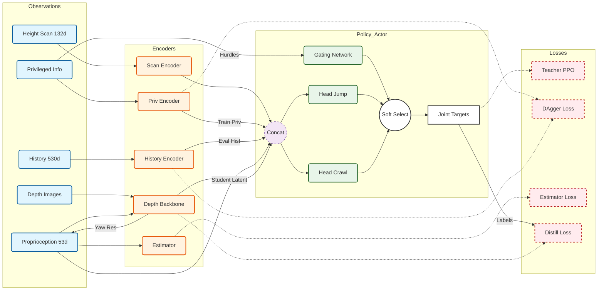

# IsaacLab Parkour



Figure 1: Architecture of the Galileo Learning Framework

----

**概述**

所提出的框架采用两阶段师生蒸馏范式，以实现四足机器人在离散障碍物上的敏捷运动。该系统由三个核心组件组成：（1）多模态观测编码器；（2）门控双头智能体；（3）分层优化目标。

**A. 多模态感知与编码**

输入空间被分为特权流和基于传感器的流。教师策略（先知策略）利用真实的环境数据，通过多层感知机（MLP，$132 \to 32$）对 132 维的射线投射高度扫描数据进行编码，并通过特权编码器对明确的物理参数（摩擦系数、质量）进行编码。为了处理部署期间的部分可观测性问题，历史编码器（一维卷积神经网络，1D - CNN）对一个时间窗口内的本体感受状态（$10 \times 53$）进行聚合，以近似特权潜在空间。相反，学生策略仅依赖机载传感。深度主干网络（卷积神经网络 + 门控循环单元，CNN + GRU）处理堆叠的深度图像（$2 \times 58 \times 87$），以生成扫描点潜在嵌入和偏航校正残差，使视觉特征与教师的几何表示对齐。

**B. 门控双头智能体**

为了解决高越障跳跃和低姿态爬行在动力学要求上的冲突，我们引入了专家混合（MoE）策略架构。一个专门的门控网络根据障碍物属性（高度/模式）计算一个软门控权重 $\alpha \in [0,1]$。该权重通过线性组合动态调节两个不同专家头（跳跃头和爬行头）的输出：$a_t = \alpha \cdot \pi_{\text{jump}}(z_t) + (1 - \alpha) \cdot \pi_{\text{crawl}}(z_t)$。这种机制在保证连续可微性的同时，允许智能体根据地形语义切换不同的运动技能。

**C. 优化与蒸馏**

训练流程遵循由粗到细的策略。教师策略通过近端策略优化算法（PPO）进行优化，并结合辅助的 DAgger 损失（$\mathcal{L}_{\text{adapt}}$），该损失迫使历史编码器重构特权潜在空间。随后，学生策略通过监督蒸馏进行训练，最小化相对于教师最优动作的 $L_2$ 重构损失。值得注意的是，学生的视觉主干网络会被联合优化以预测偏航残差，该残差会被反馈到观测循环中，以纠正长视野极限跑酷任务中的惯性测量单元（IMU）漂移。 

------

基于 Isaac Lab 的栏杆跑酷强化学习项目，覆盖 Galileo/Go2 等机器人在跳跃、钻爬和混合课程下的训练、评估与部署。

## 安装
```bash
cd IsaacLab
git clone https://github.com/CAI23sbP/Isaaclab_Parkour.git
cd Isaaclab_Parkour
pip install -e .

cd parkour_tasks
pip install --no-build-isolation -e .
# 遇到旧版本残留，可先卸载再装：
# pip uninstall -y parkour_tasks && pip install --no-build-isolation -e .
```

## 清理缓存
```bash
find . -name "*.pyc" -delete
find . -name "__pycache__" -delete
```

## 训练与评估
### 环境准备
```bash
conda activate isaaclab
cd /home/lz/Project/IsaacLab/Isaaclab_Parkour
```

### 单机单卡示例（Galileo）
```bash
LOG_RUN_NAME=galileo_teacher python scripts/rsl_rl/train.py \
  --task Isaac-Galileo-Parkour-Teacher-v0 \
  --num_envs 8192 --max_iterations 50000 --run_name auto --headless

LOG_RUN_NAME=galileo_student python scripts/rsl_rl/train.py \
  --task Isaac-Galileo-Parkour-Student-v0 \
  --num_envs 4096 --max_iterations 50000 --run_name auto --headless
```

### 多卡分布式（4 卡示例）
```bash
# 环境
cd IsaacLab/Isaaclab_Parkour/

conda activate isaaclab

# 可选：清理残留
fuser -k -9 /dev/nvidia0 /dev/nvidia1 /dev/nvidia2 /dev/nvidia3

# 安全模式变量（适配 IOMMU/带宽受限机型）
export NCCL_P2P_DISABLE=1
export NCCL_IB_DISABLE=1
export NCCL_SHM_DISABLE=1
export NCCL_SOCKET_IFNAME=ens3f3
export NCCL_ALGO=Ring
export NCCL_PROTO=Simple
export NCCL_MIN_NCHANNELS=1
export TORCH_NCCL_ASYNC_ERROR_HANDLING=1
export OMP_NUM_THREADS=1

CUDA_VISIBLE_DEVICES=0,1,2,3 torchrun --nproc_per_node=4 scripts/rsl_rl/train.py \
  --task Isaac-Galileo-Parkour-Teacher-v0 \
  --distributed --num_envs 3500 --max_iterations 50000 \
  --run_name galileo-teacher --device cuda:0

```
- `LOG_RUN_NAME` 决定日志目录名：`logs/rsl_rl/<exp>/<LOG_RUN_NAME>_<run_name>`。
- `--num_envs` 为每卡环境数，按显存调整。
- 查看可用环境：`python list_envs.py`。

### 可视化 / 评估 / 部署命令

**Play（可视化回放）**

使用 `--checkpoint` 参数指定要加载的模型文件（`*.pt`），支持相对路径或绝对路径。

```bash
# Galileo 教师模型
python scripts/rsl_rl/play.py \
  --task Isaac-Galileo-Parkour-Teacher-Play-v0 \
  --num_envs 16 \
  --checkpoint logs/rsl_rl/

# Galileo 学生模型
python scripts/rsl_rl/play.py \
  --task Isaac-Galileo-Parkour-Student-Play-v0 \
  --num_envs 16 \
  --checkpoint logs/rsl_rl/unitree_go2_parkour/galileo_teacher_auto/model_4400.pt
  --enable_cameras

```

**参数说明：**
- `--checkpoint`：指定要加载的模型文件路径（`*.pt`），必须包含完整的文件名（如 `ckpt_50000.pt`）
- `--task`：任务环境名称，**必须使用对应的 Play 版本**（以 `-Play-v0` 结尾）
  - 训练时使用：`Isaac-Galileo-Parkour-Teacher-v0`
  - Play 时使用：`Isaac-Galileo-Parkour-Teacher-Play-v0`
  - **注意**：虽然 task 名称不同，但只要训练和 Play 版本使用相同的 RL 配置（如 `UnitreeGo2ParkourTeacherPPORunnerCfg`），模型就可以兼容加载。Play 版本主要调整了环境配置（可视化、固定地形布局等），但模型结构相同。
- `--num_envs`：并行环境数量，建议设置为 16 或更少以提升性能
- `--enable_cameras`：启用相机传感器（可选，用于可视化）
- 不指定 `--checkpoint` 则使用未训练的随机权重

**环境重置条件说明：**
机器人会在以下情况下被重置（定义在 `parkour_isaaclab/envs/mdp/terminations.py`）：
1. **正常完成**：到达所有目标点（默认 8 个目标点）
2. **时间超时**：超过最大 episode 长度（Play 版本为 60 秒）
3. **摔倒**：机器人翻滚角度过大（roll 或 pitch > 1.5 弧度，约 86 度）
4. **掉落**：机器人高度 < -0.25 米

如果某些机器人提前重置，通常是摔倒或掉落导致的。可以通过调整终止条件阈值来修改这些行为。

**评估**
```bash
python scripts/rsl_rl/evaluation.py \
  --task Isaac-Galileo-Parkour-Teacher-Play-v0 \
  --num_envs 16 \
  --checkpoint logs/rsl_rl/<exp>/<run>/checkpoints/ckpt_50000.pt
```

**部署 demo**
```bash
python scripts/rsl_rl/demo.py \
  --task Isaac-Galileo-Parkour-Teacher-Play-v0 \
  --num_envs 8 \
  --checkpoint logs/rsl_rl/<exp>/<run>/checkpoints/ckpt_50000.pt \
  --enable_cameras
```

常见环境 ID：  
- 教师：`Isaac-Galileo-Parkour-Teacher-v0` / `...-Teacher-Play-v0`  
- 学生：`Isaac-Galileo-Parkour-Student-v0` / `...-Student-Play-v0`  
- Go2 任务同名替换即可。

### git 强制覆盖代码
```bash
git fetch --all
git reset --hard origin/master
```

### TensorBoard
```bash
tensorboard --logdir logs --port 6006
```

#### TensorBoard 指标解读（训练效果怎么判）

TensorBoard 里的曲线大致分四类：**Train（总体表现）**、**Loss（优化是否稳定）**、**Episode_Reward（奖励拆解）**、**Metrics（任务/课程进度）**。  
下面按你日志中常见的每个 key 解释“它是什么/怎么看好坏/出现异常怎么办”。

**1. Train/**（最重要，直接看训练有没有在变好）

- `Train/mean_reward` / 控制台 `Mean reward`  
  代表一个 episode 的总回报均值。  
  - 期望：整体上升，或者在课程升级后出现“台阶式上升”。  
  - 坏信号：长期在低值震荡、突然掉到负值并维持，通常是策略崩了（如 gate 塌缩、动作噪声过大、奖励权重不平衡）。  
  - 看法：不要盯每一步的抖动，看 1k–5k iter 的趋势。

- `Train/mean_episode_length` / 控制台 `Mean episode length`  
  代表机器人能稳定存活/推进的时间。  
  - 期望：早期快速从个位数涨到几百步，最后接近上限（如 1000）。  
  - 坏信号：长期很短（<50），说明还没学会基本站稳/走稳；此时奖励项大多为 0，PPO 几乎学不到东西。  
  - 排查：先看 gate 是否塌缩（`gate_entropy`）、动作噪声是否过大（`action noise std`）、终止原因是否集中在摔倒/碰撞。

- `Train/action_noise_std` / 控制台 `Mean action noise std`  
  Actor 高斯策略的标准差（探索幅度）。  
  - 期望：从初始化值逐步下降到一个“既不抖也不僵”的区间；不同任务会停在不同水平。  
  - 太高：动作很随机、episode 变短、各种惩罚项上升。  
  - 太低且过早：策略很快变得“死板”，容易卡在次优行为（比如用同一套动作应付所有栏杆）。

**2. Loss/**（看优化是否“在学习”且是否稳定）

- `Loss/value_function`（值函数损失）  
  Critic 在拟合 return 的误差。  
  - 期望：前期较高，随后下降到一个稳定区间。  
  - 坏信号：一直很高且不降 → critic 学不到（回合太短/奖励太稀疏）；突然爆炸 → 学习率过大或 reward 量级跳变。

- `Loss/surrogate`（PPO 代理损失）  
  Actor 的主优化目标（越小越好，但通常围绕 0 小幅波动）。  
  - 期望：围绕 0 波动、偶尔为正/负都正常。  
  - 坏信号：长期接近 0 且 `mean_episode_length` 很短 → 说明优势估计噪声大、没有有效梯度。

- `Loss/entropy`（策略熵/探索强度） + 控制台 `Mean entropy loss`  
  反映动作分布的随机性。  
  - 期望：早期高、后期缓慢下降（学会更确定的动作）。  
  - 坏信号：很早掉到极低 → 探索不足、容易陷入坏局部最优；一直很高 → 动作仍很随机、站不稳。

- `Loss/estimator`（显式特权估计器损失）  
  现在只回归 `priv_explicit_other` 的 9 维（主要是 base 线速度）。  
  - 期望：下降到较低稳定值。  
  - 坏信号：降不下去 → 估计目标不合理或输入不足；过早接近 0 但策略还很差 → estimator 虽准但主策略没学到（多半是 rollout 太短）。

- `Loss/priv_reg` 与 `Loss/priv_reg_coef`  
  历史编码器与特权隐式 latent 对齐的正则及其系数 schedule。  
  - 期望：系数随迭代上升；priv_reg loss 随之下降。  
  - 坏信号：priv_reg loss 很大且不降 → 历史编码器没学到有效记忆（常见于 episode 太短）。

- `Loss/hist_latent`  
  DAgger 更新时的历史 latent 对齐误差。  
  - 期望：跟 priv_reg 类似，逐步下降。  

- **MoE/Gating 相关**  
  - `Loss/moe_aux`：门控辅助损失（balance/diversity/entropy 的加权和）。  
    期望：数值不需要很小，关键是稳定且不主导总 loss。  
  - `Loss/gate_entropy`：门控分布熵。  
    - 接近 `log(num_experts)` → gate 近似均匀（还没分化）。  
    - 接近 0 → gate 一热塌缩（早期若出现会导致训练崩）。  
    期望：早期略低于 `logK`，随后随课程多样性逐步下降。  
  - `Loss/gate_min_usage`：最少使用专家的平均占比。  
    期望：早期别太小（保活），后期允许变小（专精）。  
  - `Loss/gating_temperature`：当前 softmax 温度（按 schedule 退火）。  
    越低 gate 越硬；正常应随训练下降。  
  - `Loss/gate_usage/<expert>`（新增）  
    每个专家的平均使用率（如 `flat/jump/crawl`）。  
    期望：早期三者都 >0；中后期随障碍出现频率自然分化，但不会长期为 0。  

**3. Episode_Reward/**（看奖励分解是否“按你想的方式在起作用”）

每一项都是 episode 内该项奖励的平均值。  
读法：  
- 先看正向项（如 `reward_tracking_goal_vel`、`reward_jump_clearance`、`reward_crawl_clearance`）有没有随着训练明显上升；  
- 再看惩罚项（如 `reward_collision`、`reward_orientation`、`reward_action_rate`）是否逐步趋近 0（说明动作更平稳/安全）。  
常见现象：  
- 如果 episode 很短，几乎所有项都会≈0 —— 这时先解决“站稳活久”，别急着调奖励。  
- 某个惩罚项绝对值持续很大，通常是该约束在“硬拽”策略，可考虑权重是否过强。

**4. Metrics/**（看任务/课程是否在推进）

- `Metrics/base_parkour/current_goal_idx`、`far_from_current_goal`  
  当前目标序号和距目标距离。  
  - 期望：goal_idx 随训练变大、距离变小 → 说明真的在前进。  
  - 若 goal_idx 长期为 0 且距离大 → 还没学会到第一个目标。

- `Metrics/base_parkour/terrain_level_mean/max`、`curriculum_stage`  
  课程阶段/地形难度。  
  - 期望：随着训练逐步上升；上升时 reward/episode length 可能暂时回落是正常的。  
  - 长期卡 0 → 课程没触发升级（通常是成功率门槛太高或 timeout 居多）。

- `hurdle_height_mean_cm/min_max_cm`  
  当前训练分布里的栏杆高度统计。  
  用来确认 jump/crawl 数据是否真的出现；如果 max 从不超过 35cm，crawl 专家就不可能学到。

- `Metrics/base_velocity/error_vel_xy/yaw`  
  速度/航向跟踪误差。  
  期望逐步下降到稳定小值；若 reward 很高但误差仍大，说明策略可能通过“取巧”刷别的奖励。

**5. Perf/**（训练吞吐与耗时，仅作工程监控）

- `Perf/total_fps`、`collection time`、`learning_time` 用来判断是否有性能退化或显存瓶颈，对算法收敛本身不敏感。

## Isaac Sim 视口常用操作
- Tab 返回 viewport；Alt+LMB 旋转，Alt+MMB 平移，Alt+RMB/滚轮 缩放。
- 可选自由相机（Orbit/Fly），F 聚焦选中物体后再导航。
- GUI 运行时按 Space 暂停/继续，方便调整视角；`--enable_cameras` 保持传感器工作。

## 多卡故障速查
- NCCL 非法访存/卡死：保持上面的“安全模式”环境变量，必要时再加 `export CUDA_LAUNCH_BLOCKING=1` 获取堆栈。
- 若仍不稳定：减小 `--num_envs` 或先用对称带宽的卡组；长期方案是关闭 BIOS IOMMU/VT-d 恢复 P2P，并移除禁用变量以提升吞吐。

## 仿真到部署进度
- [x] 教师/学生训练代码开放
- [x] Isaac Lab 内部署 demo（`scripts/rsl_rl/demo.py`）
- [x] 仿真到仿真（MuJoCo）迁移示例
- [ ] 仿真到现实（计划中）

## 许可与引用

若在研究中使用，请引用：
```
@article{cheng2023parkour,
  title={Extreme Parkour with Legged Robots},
  author={Cheng, Xuxin and Shi, Kexin and Agarwal, Ananye and Pathak, Deepak},
  journal={arXiv preprint arXiv:2309.14341},
  year={2023}
}
@article{mittal2023orbit,
  author={Mittal, Mayank and Yu, Calvin and Yu, Qinxi and Liu, Jingzhou and Rudin, Nikita and Hoeller, David and Yuan, Jia Lin and Singh, Ritvik and Guo, Yunrong and Mazhar, Hammad and Mandlekar, Ajay and Babich, Buck and State, Gavriel and Hutter, Marco and Garg, Animesh},
  journal={IEEE Robotics and Automation Letters},
  title={Orbit: A Unified Simulation Framework for Interactive Robot Learning Environments},
  year={2023},
  volume={8}, number={6}, pages={3740-3747},
  doi={10.1109/LRA.2023.3270034}
}
```

仓库引用：`https://github.com/CAI23sbP/Isaaclab_Parkour`

## 联系
`sbp0783@hanyang.ac.kr`
